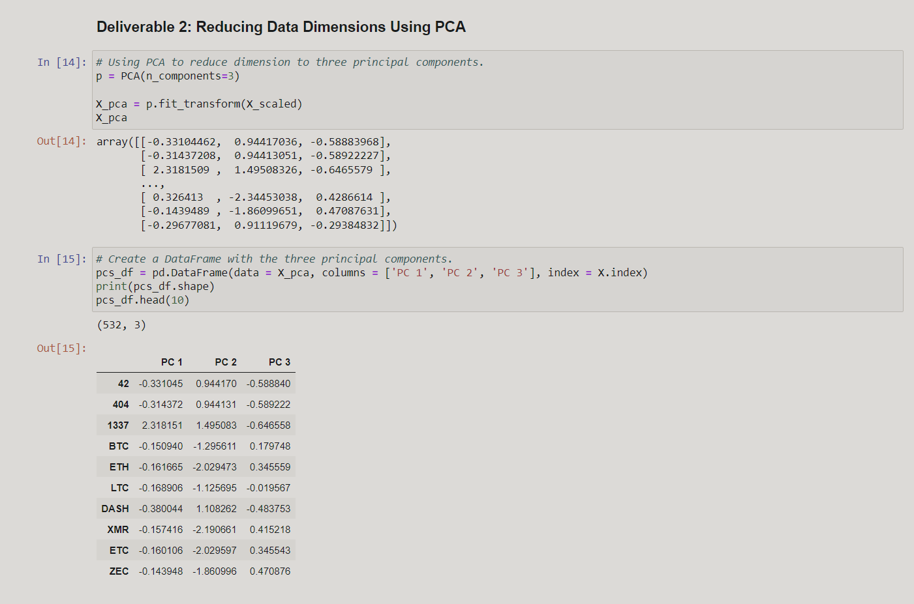
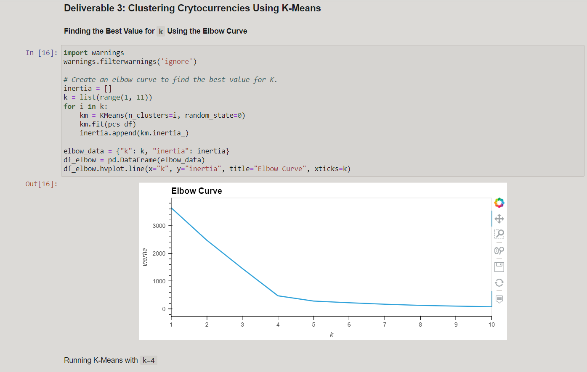
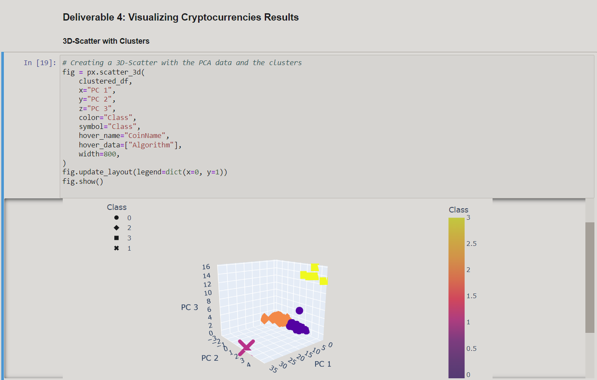
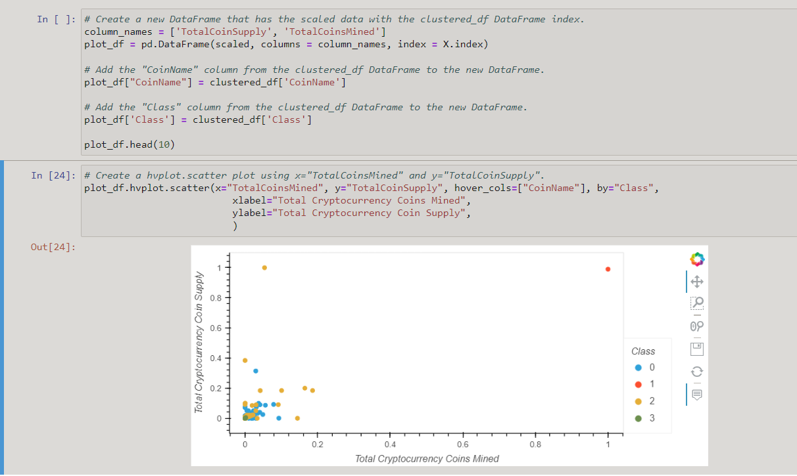

# Cryptocurrencies

This repository will demonstrate the use of unsupervised learning, how to process data, how to cluster, how to reduce dimensions, and how to reduce the principal components using PCA.

## Project Overview

To create a report for a client that includes what cryptocurrencies are on the trading market and how they could be grouped to create a classification system for this new investment. This includes:

* Preprocessing the Data for PCA
* Reducing Data Dimensions Using PCA
* Clustering Cryptocurrencies Using K-means
* Visualizing Cryptocurrencies Results

## Results

------------------------------------------------

---------------------------------------------------------

---------------------------------------------------------

### Visualizing Cryptocurrencies Results

#### Using 3D-Scatter

------------------------------------------------------------

#### Using Scatter plot 

------------------------------------------------------------
